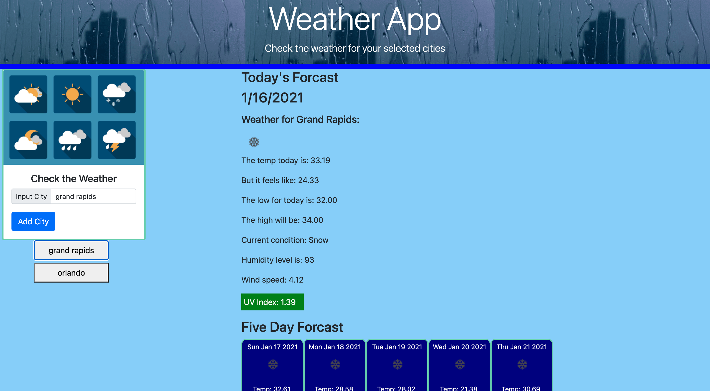

# Weather-App
Creating a website to allow to check the weather for selected cities.

We needed to create an html, css, and javascript file.

We needed to display an input field to input a city to check 

We needed to add buttons for each city was put in

When the city button was selected we need to display the current day weather, with certain parameters.

We also needed to show a five day forecast.

We needed to show the weather icon.

We needed to show the temperature.

We needed to show the UV index, along with color to show the condition of the UV index.

We needed to show the hunidity.

I used past homework and activities as resources to help with code and to facilitate the completion of this project.

Other resources used were w3school, mozilla, and youtube

Below is a screen shot of the scheduler online

Below is a link to the repository 
https://github.com/HectorDiazJr/Weather-App

Below is al link to the scheduler  
https://hectordiazjr.github.io/Weather-App/
